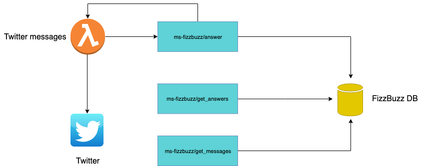

# cloudia_challenge
Back End challenge from Cloudia

### description
Micro-service to FizzBuzz chatbot, when a person send a numbers to the service he will process and respond.
*If a number is mutiple of 3, bot will responde Fizz
*If a number is multiple of 5, bot will respond Buzz
*If a number is mutiple of 3 and 5, bot will respond FizzBuzz



### File tree
```
    .
    ├── src                    
      ├── builders             # Process the data for the format of service. 
      ├── models               # DB models
      ├── queries              # DB queries
      ├── tests                # Tests for all application
      └── views                # Process requisitions
    ├── migrations          # Migrations maded with DB
    ├── app                 # Service app
    ├── config              # Variables of ambient
    └── run                 # Start service
```

### Build Application
To build application make this steps:

```bash
    pip install -r requirements.txt
    flask init
    flask migrate
    flask upgrade
    python run.py
```


### Routes

### **POST** /answer
- Respond answer for twitter bot

>:white_check_mark: **_Retorno com sucesso_**

>**HTTP Status** `200`
```
{
    "answer": "Fizz Buzz"
}
```


>:x: **_Retorno default_**

>**HTTP Status** `400`

**Response**
```
{ "message": "quote is invalid" }
```


### **GET** /interaction/:id_interaction
- Respond interaction

>:white_check_mark: **_Retorno com sucesso_**

>**HTTP Status** `200`
```
{
    "id_interaction": 1,
    "quote": "3 5",
    "answer": "Fizz Buzz",
    "user": {
      "name": "Twitter",
      "plataform": "twitter"
    }
}
```


>:x: **_Retorno default_**

>**HTTP Status** `404`

**Response**
```
{ "message": "interaction is not valid" }
```


### **GET** /user/:id_user/interaction
- Respond interaction

>:white_check_mark: **_Retorno com sucesso_**

>**HTTP Status** `200`
```
{
    "name": "user",
    "plataform": "twitter",
    "answer": "Fizz Buzz",
    "interaction": {
      "quote": "3 5",
      "answer": "Fizz Buzz"
    }
}
```


>:x: **_Retorno default_**

>**HTTP Status** `404`

**Response**
```
{ "message": "user is not valid" }
```
